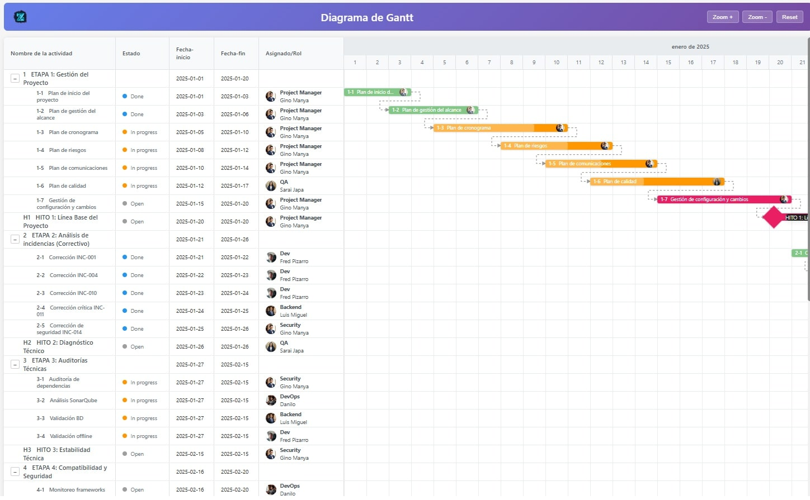

# Diagrama de Gantt

Un diagrama de Gantt interactivo construido con TypeScript, HTML y CSS.



## Características

- ✅ Visualización de actividades y hitos
- ✅ Indicadores de progreso
- ✅ Roles y responsabilidades
- ✅ Zoom in/out
- ✅ Tooltips informativos
- ✅ Datos parametrizables mediante JSON

## Instalación

1. Instalar dependencias:
```bash
npm install
```

## Uso

1. Compilar:
```bash
npm run start:dev
```

2. Abrir en el navegador: `http://localhost:8080`

## Personalizar Datos

Edita el archivo `data.json` para personalizar tu proyecto:

```json
{
  "proyecto": "Nombre del Proyecto",
  "fechaInicio": "2024-01-01",
  "fechaFin": "2024-06-30",
  "actividades": [
    {
      "id": "act-1",
      "nombre": "Nombre de la Actividad",
      "fechaInicio": "2024-01-01",
      "fechaFin": "2024-01-15",
      "tipo": "actividad",  // "actividad" o "hito"
      "progreso": 100,      // 0-100
      "rol": "Nombre del Rol",
      "color": "#4CAF50",
      "descripcion": "Descripción opcional"
    }
  ]
}
```